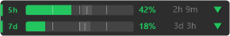
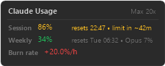

## Claude Usage Monitor — a Windows taskbar widget for Claude.ai usage

A Windows tray app that shows your Claude.ai / Claude Code usage at a glance: a widget floating just above the system tray, a dual progress-ring tray icon, and 90% usage alerts. Most usage monitors are macOS menu-bar apps — this one is built for the **Windows taskbar**.

**No session keys, no cookies, no separate login.** It reuses the OAuth token **Claude Code** already stored on your machine; that token never leaves your computer and the only network call is a single authenticated request to Anthropic's own usage API.

| Dark theme | Light theme | Hover detail card |
|:---:|:---:|:---:|
|  |  |  |

## Features

- **5h session + 7d weekly progress bars** with percentage, countdown (e.g. `91% — 2h 3m`), tick marks at 25/50/75%, and a pace arrow (▲ ahead / ▼ under / • on pace)
- **Burn rate tracker** — shows depletion ETA and warns when you're burning faster than expected
- **Hover detail card** — full stats (session, weekly, Opus breakdown, extra usage) shown on mouse-over; widget fades and becomes click-through when not needed
- **Opus breakdown** — separate bar for Opus-model weekly usage on plans that expose it
- **Signed-out quiet state** — dims to last-known reading with an offline dot instead of showing errors
- **Phone notifications via ntfy** — optional push alerts to your phone (configure a ntfy topic in settings)
- **Dual progress-ring tray icon** — outer 5h ring (green → yellow → red), inner 7d ring (cyan → amber → red at critical)
- **90% usage alerts** — one-time balloon per reset window; re-arms automatically
- **Start with Windows** — toggle in the tray menu (per-user registry Run entry, no installer)
- **Update notifications** — checks GitHub Releases once a day

## Install

Download `ClaudeUsageMonitor.exe` from the [latest GitHub Release](https://github.com/ZeuLeg/Claude-Usage-Monitor/releases/latest). No installer — just run it.

**Requirements:** [Claude Code](https://docs.anthropic.com/en/docs/claude-code) installed and logged in (`claude login`) + .NET 10 runtime. Zero external dependencies.

## Build from source

```bash
git clone https://github.com/ZeuLeg/Claude-Usage-Monitor.git
cd Claude-Usage-Monitor
dotnet build ClaudeUsageMonitor.sln -c Release
dotnet run --project ClaudeUsageMonitor.csproj
```

If you're logged into Claude Code, the tray icon should show your session usage within seconds.

## How it works

The app reads the OAuth token that **Claude Code** stores in your Windows Credential Manager, then calls the Anthropic OAuth usage API. One HTTP request. No browser, no cookies, no WebView2, no manual configuration.

### Automatic token refresh

Claude Code's access token expires every few hours. The app detects expiry before each poll and delegates refresh to the official `claude` CLI automatically — no action needed. As long as `claude` is on your PATH (it already must be), the app stays logged in indefinitely after a single `claude login`.

> **Note:** `claude setup-token` / `CLAUDE_CODE_OAUTH_TOKEN` is **not** recommended for this app. Tokens generated by `setup-token` lack the `user:profile` scope required by the usage endpoint and will receive HTTP 403.

## What you see

- **Taskbar widget** — floating just above the system tray, always on top. Shows two progress bars (`5h` session + `7d` weekly) with percentage, countdown (e.g. `91% - 2h 3m`), and a pace arrow (▲ ahead / ▼ under / • on pace). Bars have tick marks at 25%/50%/75% for reference. Colors shift green → yellow → red by utilization. Adapts to Windows light and dark themes. Updates automatically when the displayed countdown changes. Fades out when hovered (click-through when invisible).
- **Tray icon** — two concentric rings: the outer `5h` session ring shifts green → yellow → red as you approach the limit. The inner `7d` weekly ring is cyan by default (the app's weekly-reference color) and escalates to amber/red only when weekly usage gets critical. Dims to the last-known reading when offline.
- **Tooltip** (hover the tray icon) with session %, weekly % (with pace), reset timers, and monthly `extra usage` spend when pay-as-you-go is enabled
- **Right-click** menu: Refresh, Copy Status Text, Open Log Folder, Start with Windows, Check for Updates, About, Exit

If the taskbar is unavailable (unsupported shell), the app falls back gracefully to the tray icon + tooltip only.

## Extras

- **Usage alerts** — a one-time balloon when your `5h` session or `7d` weekly window crosses 90%, so you don't blow past a limit unnoticed (it re-arms after each reset).
- **Start with Windows** — toggle it in the tray menu (no installer; just a per-user registry Run entry).
- **Update notifications** — checks GitHub Releases about once a day and tells you when a newer version is out.
- **Sleep & offline resilient** — recovers within seconds of the connection returning after standby or a network drop, and keeps showing your last-known usage (dimmed, with an offline dot) while offline instead of an error.

## How it actually works (technically)

1. Reads `"Claude Code-credentials"` from Windows Credential Manager, then falls back to `%USERPROFILE%\.claude\.credentials.json` (and `%HOMEDRIVE%%HOMEPATH%\.claude\` as a second fallback)
2. Extracts the `claudeAiOauth.accessToken` 
3. Calls `GET https://api.anthropic.com/api/oauth/usage` with Bearer auth
4. Parses `five_hour`, `seven_day`, and `extra_usage` from JSON response
5. Updates tray icon every 2 minutes (every 60 seconds while the widget is open)

Inspired by [omachala's bash gist](https://gist.github.com/omachala/5ea5af4bfa0b194a1d48d6f2eedd6274) which does the same thing for macOS/CLI.

## Token expired?

Run `claude login` in your terminal — the app keeps retrying on a short backoff and picks up the new token automatically on the next poll, so it self-heals without a restart.

## Project structure

```
src/
├── Program.cs                 # Entry point
├── App/                       # MainForm coordinator, tray icon renderer, menu, autostart, palette
├── Polling/UsagePoller.cs     # Poll loop, exponential backoff, power/network recovery
├── Ui/                        # Floating taskbar widget + About dialog
├── Api/                       # HTTP fetch, data model, credential reader
└── Infra/                     # Logger, update checker, Win32 P/Invoke
```

## License
MIT License – See [LICENSE](LICENSE) file
